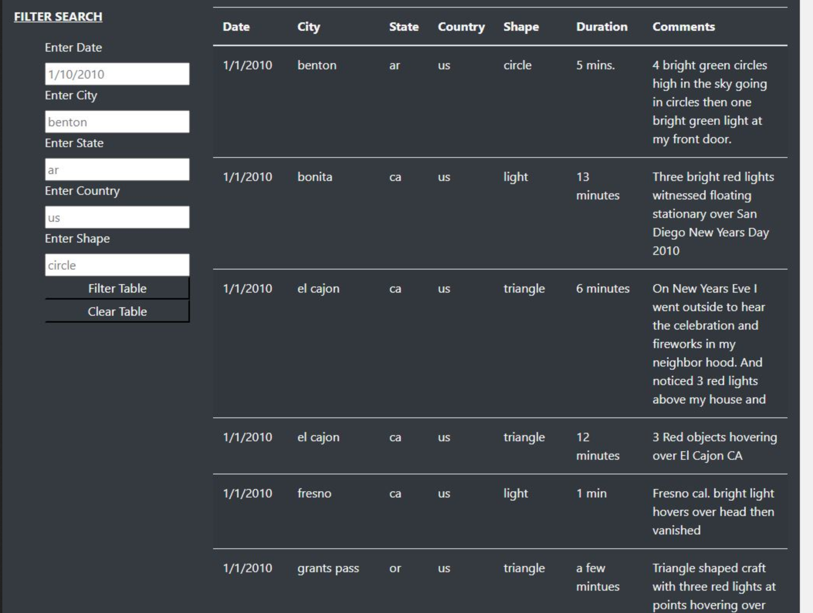
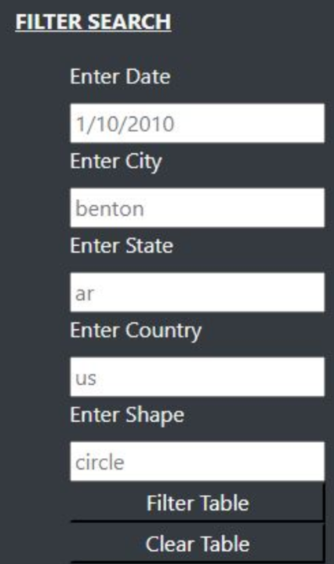
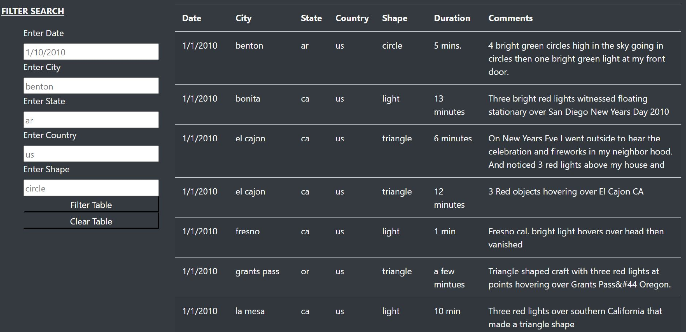
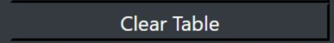

# UFOs

# Deliverable 1: Filter UFO sightings on multiple criteria

**Deliverable 1 Requirements**

The list element that creates the button is removed, and there are five list elements for filtering in the index.html file.

    <!--Filter and Table-->
    

        

          

                <form class="bg-dark">
                    
Filter Search

                    <ul class="bg-dark">

                        <!-- CHALLENGE NEED - Filter Using New <form> Tag-->
                        <li class="list-group" class="btn-dark">
                                <label for="date">Enter Date</label>
                                <input type="text" placeholder="1/10/2010" id="datetime" />
                        </li>

                        <li class="list-group" class="btn-dark">
                            <label for="city">Enter City</label>
                            <input type="text" placeholder="benton" id="city">
                        </li>

                        <li class="list-group" class="btn-dark">
                            <label for="state">Enter State</label>
                            <input type="text" placeholder="ar" id="state">
                        </li>

                        <li class="list-group" class="btn-dark">
                            <label for="country">Enter Country</label>
                            <input type="text" placeholder="us" id="country">
                        </li>

                        <li class="list-group" class="btn-dark">
                            <label for="shape">Enter Shape</label>
                            <input type="text" placeholder="circle" id="shape">
                        </li>

                    </ul>
                </form>
          

          <!--Dynamic Table-->
          

                <table class="table table-striped">
                <thead>
                        <tr>
                            <th>Date</th>
                            <th>City</th>
                            <th>State</th>
                            <th>Country</th>
                            <th>Shape</th>
                            <th>Duration</th>
                            <th>Comments</th>
                        </tr>
                </thead>
                <tbody></tbody>
                </table>
          

name-of-you-image

The event listener is modified to detect changes to each filter in the app.js file.

// 1. Create a variable to keep track of all the filters as an object.
var filters = {};

// 3. Use this function to update the filters. 
function updateFilters() {

    // 4a. Save the element that was changed as a variable.
    let inputElement = d3.select(this);

The updateFilters() function saves the element, value, and the id of the filter that was changed.

function updateFilters() {

    // 4a. Save the element that was changed as a variable.
    let inputElement = d3.select(this);

    // 4b. Save the value that was changed as a variable.
    let inputValue = inputElement.property("value");

    // 4c. Save the id of the filter that was changed as a variable.
    let inputID = inputElement.attr("id");

The filterTable() function loops through all of the filters and keeps any data that matches the filter values.

    // 5. If a filter value was entered then add that filterId and value
    // to the filters list. Otherwise, clear that filter from the filters object.

        if (inputValue) {
            filters[inputID] = inputValue;
        } else{filters ={};};
 
  
    // 6. Call function to apply all filters and rebuild the table
    filterTable(filters);
  
  }

The webpage filters the table correctly based on user input.

    // 7. Use this function to filter the table when data is entered.
  function filterTable() {
  
    // 8. Set the filtered data to the tableData.
    let filteredData = tableData;
  
    // 9. Loop through all of the filters and keep any data that
    // matches the filter values
    Object.entries(obj).forEach(([fkey, fval]) =>{
        
      filteredData = filteredData.filter((row) => row[fkey] === fval)
          

  });  
  
    // 10. Finally, rebuild the table using the filtered data
    buildTable(filteredData); 
  }

# Deliverable 2: A written report on the UFO analysis

**Analysis (12 points)**

**Overview + Purpose:**

Overview: Dana’s webpage and dynamic table are working as intended, but she’d like to provide a more in-depth analysis of UFO sightings by allowing users to filter for multiple criteria at the same time. In addition to the date, you’ll add table filters for the city, state, country, and shape.

Purpose: The purpose of this project is to provide a more in-depth analysis of UFO sightings by allowing users to filter for multiple criteria at the same time. In addition to the date, we are asked to add table filters for the city, state, country, and shape.

**Results:**

Step 1. Look at the homepage

Step 2. Go to FILTER SEARCH

Step 3. Sort by specific filter of your choosing

Step 4. When the results show, look at them. You may click on Clear search if you want to perform a new search. 
     

**Summary:**
- The summary addresses one drawback of this webpage

One drawback was using Github as a publicly available outlet of pooling informaiton. 

- The summary addresses two additional recommendations for further development
For further devleopment, the following are reccomended: 

1. GitHub Pages - For Website Presentation

2. To better integrate a HTML, CSS, and JavaScript workflow that feeds UFO data from self-automated work groups. For example, from established UFO-ologist websites. 
